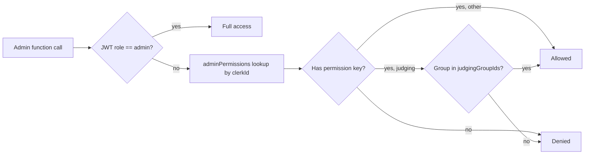

# Admin access permissions, judging delegation, and docs

## Current state (verified)

- Admin access is all-or-nothing: Clerk JWT `role === "admin"` checked by `requireAdminRole` / `isUserAdmin` in [convex/users.ts](convex/users.ts) (lines 328-420), used by every admin function. Frontend gates via `api.users.checkIsUserAdmin` in [src/components/admin/AdminDashboard.tsx](src/components/admin/AdminDashboard.tsx) and shows a 404 otherwise.
- Judging has no per-user access model: groups use passwords plus anonymous judge sessions. All management is admin-only across `judgingGroups`, `judgingCriteria`, `judgingGroupSubmissions`, `judgeScores`, `adminJudgeTracking`, `aiJudge`, `agentJudges`.
- **AI judge GitHub check: confirmed working.** [convex/aiJudgeAnalysis.ts](convex/aiJudgeAnalysis.ts) fetches repo metadata, full file tree, package.json, README, up to 60 Convex source files (40 into the prompt), and up to 300 commits via the authenticated GitHub REST API (`GITHUB_TOKEN` required, rate-limit retry). Known limits, which the new docs will state: public GitHub repos only, Convex-centric file selection, 8k chars/file and 180k total caps. No code changes needed here.
- No docs page exists; `react-markdown` rendering is already available.

## Architecture

Convex permissions table (chosen). Full admins keep the Clerk JWT role and bypass everything; delegated users get grants stored in Convex, effective instantly, revocable instantly, no Clerk changes or token refresh needed.



## 1. Schema: `adminPermissions` table

New table in [convex/schema.ts](convex/schema.ts):

```ts
adminPermissions: defineTable({
  userId: v.id("users"),
  clerkId: v.string(), // fast lookup from identity
  permissions: v.array(v.string()), // permission keys below
  judgingGroupIds: v.array(v.id("judgingGroups")),
  allJudgingGroups: v.optional(v.boolean()), // access to every group
  grantedBy: v.id("users"),
  notes: v.optional(v.string()),
})
  .index("by_userId", ["userId"])
  .index("by_clerkId", ["clerkId"]);
```

## 2. Permission keys per admin section

- **Moderation** (`ContentModeration`): `moderation.view`, `moderation.moderate` (approve/reject/hide/archive/pin/edit/tags/custom message), `moderation.delete`
- **Tags** (`TagManagement`): `tags.view`, `tags.manage` (create/edit/order/visibility), `tags.delete`
- **Forms** (`FormFieldManagement`, `Forms`, `FormBuilder`, `FormResults`): `forms.view`, `forms.manage`, `forms.results`, `forms.delete`
- **Judging** (scoped to granted groups): `judging.view`, `judging.manage` (group settings, criteria, submissions, passwords), `judging.results`, `judging.tracking` (edit/hide/delete scores, notes), `judging.ai` (run AI reviews, edit AI scores, agent keys), `judging.delete` (delete group)
- **Numbers**: `numbers.view`
- **Users** (`UserModeration`, reports): `users.view`, `users.moderate` (ban/pause/verify), `users.reports`, `users.delete`
- **Emails**: `emails.view`, `emails.send`
- **Settings**: `settings.view`, `settings.manage`
- **Access management itself**: full-admin only, never delegatable.

## 3. Backend: new `convex/adminAccess.ts` plus guard updates

New file with:

- `getAccessContext(ctx)` helper: returns `{ isAdmin: true }` for JWT admins, else loads the grant row by clerkId.
- `requirePermission(ctx, key)` and `requireJudgingGroupPermission(ctx, groupId, key)` helpers.
- Public query `getMyAdminAccess` (for frontend tab gating; returns permissions plus allowed group ids, null for regular users).
- Admin-only CRUD: `grantAccess`, `updateAccess`, `revokeAccess`, `listGrants` (with user details), reusing existing `listAllUsersAdmin` search for user lookup.

Then swap `requireAdminRole(ctx)` for the matching `requirePermission` call in the delegated surfaces: [convex/tags.ts](convex/tags.ts), story/comment admin ops in [convex/stories.ts](convex/stories.ts) and comments, [convex/storyFormFields.ts](convex/storyFormFields.ts), [convex/forms.ts](convex/forms.ts), user moderation and reports in [convex/users.ts](convex/users.ts) / reports files, [convex/settings.ts](convex/settings.ts), email functions, [convex/adminQueries.ts](convex/adminQueries.ts) (numbers), and the judging files: [convex/judgingGroups.ts](convex/judgingGroups.ts), [convex/judgingCriteria.ts](convex/judgingCriteria.ts), [convex/judgingGroupSubmissions.ts](convex/judgingGroupSubmissions.ts), [convex/judgeScores.ts](convex/judgeScores.ts), [convex/adminJudgeTracking.ts](convex/adminJudgeTracking.ts), [convex/aiJudge.ts](convex/aiJudge.ts), [convex/agentJudges.ts](convex/agentJudges.ts).

Judging list queries (`listGroups` etc.) filter results to the caller's allowed groups when not a full admin; every group-targeted function verifies the specific `groupId` is in scope. Public judge/results/session functions are untouched.

## 4. Frontend: gated dashboard plus new Access section

- [src/components/admin/AdminDashboard.tsx](src/components/admin/AdminDashboard.tsx): replace the `checkIsUserAdmin` gate with `getMyAdminAccess` (admin OR any grant gets in; others still 404). Render only permitted tabs; pass an access context (React context) down so components can hide actions (e.g. delete buttons hidden without the delete key).
- New **Access** tab (full admins only) with `src/components/admin/AccessManagement.tsx`:
  - User search (name/email/username with avatars, using the existing paginated admin user search).
  - Grant editor following the existing design system (white panels, `border-gray-200`, black buttons, Sonner toasts, `AlertDialog` confirms): one card per section with a master toggle plus action checkboxes, a judging group multi-select (or "all groups"), summary chips of what the user can do, and grant/revoke with confirmation.
  - Grants list showing who has access, what, granted by whom and when.
- Update secondary admin route gates the same way: [src/pages/JudgeTrackingPage.tsx](src/pages/JudgeTrackingPage.tsx), [src/components/admin/FormBuilder.tsx](src/components/admin/FormBuilder.tsx), [src/components/admin/FormResults.tsx](src/components/admin/FormResults.tsx).
- [src/components/admin/Judging.tsx](src/components/admin/Judging.tsx) and children: show only allowed groups, hide delete/AI/tracking controls per permission.

## 5. Docs tab in /admin

New **Docs** tab with `src/components/admin/AdminDocs.tsx` (visible to full admins and anyone with `judging.view`): a sidebar-nav docs reader rendered with the existing `react-markdown` setup covering all judging features:

- Groups (create/edit, active, public/private, passwords for judges/submission/results/AI results, event dates)
- Criteria and weights, multi-judge (`judgesPerSubmission`)
- Submissions (manual add from Moderation, required-tag sync, auto-include tags plus date window, custom submission page)
- Judge flow (slug URL, access code, sessions, notes, completion)
- Results and tracking (public results, CSV exports, score editing/visibility)
- AI judge: how it works end to end including the GitHub repo reading behavior verified above, required env vars (`GITHUB_TOKEN`, model keys, optional `FIRECRAWL_API_KEY`), rubric weights, retries, and its limits
- Agent judges: API keys, HTTP endpoints, advisory scores
- The new access system itself (how to delegate judging groups to organizers)

## 6. Other things covered (your "anything else" bullet)

- Revocation and changes are instant (DB lookup, no stale JWT problem).
- Audit trail via `grantedBy` / `_creationTime` / `notes` on grants.
- Full admins are completely unaffected (JWT check runs first, zero behavior change).
- Delegated users never see or manage the Access tab, Emails, or Settings unless granted; destructive actions require explicit delete keys.
- The unused DB `users.role` field and temp admin mutations stay as-is; the old [prds/adminroles.md](prds/adminroles.md) gets superseded by a new PRD.
- AI judge needs no fix; its GitHub limits get documented instead. Optional future work (not in this plan): fetching non-Convex source files, tarball fetch, private repo support.

## Docs and tracking

Per workflow: new PRD `prds/admin-access-permissions.md`, update `task.md`, `changelog.md` (real git dates), and `files.md` at the end.
