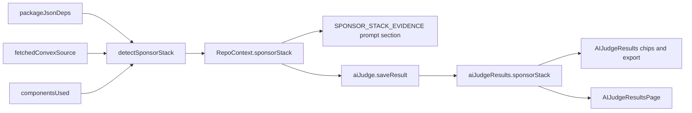

# Fix AgentMail component detection and add sponsor stack evidence

## Part A: AgentMail component name resolution

### Why

`COMMUNITY_COMPONENT_PACKAGES` in [convex/aiJudgeAnalysis.ts](convex/aiJudgeAnalysis.ts) (line 122) maps Firecrawl, Exa, Context.dev, Browser Use, and agent-ready, but not AgentMail. For a repo using `@agentmail/convex`:

- `canonicalComponentName("@agentmail/convex")` (line 130) returns `null`, so package.json contributes nothing.
- `nameFromConfigImport("@agentmail/convex")` (line 145) falls through to the raw string `"@agentmail/convex"` because the last path segment is `convex`, not `*-convex`.
- `extractComponentsUsed` (line 493) records `components.agentmail` as `"agentmail"`; the normalizer compares `agentmailconvex` to `agentmail` and cannot match.

Two visible bugs result:

- The CONVEX COMPONENTS prompt section (line 1751) tells the model AgentMail is both "Used in code: agentmail" and "Installed but not referenced: @agentmail/convex". Both lines are labeled authoritative.
- The hackathon.md cross-check (line 1381) lowercases `componentsInstalled` and looks for the claimed name, so `components: agentmail` in a team's log produces a false "not found in the repo scan" discrepancy.

Firecrawl is unaffected: `@firecrawl/firecrawl-convex` maps to `firecrawl` and `components.firecrawl` matches.

### Change

1. Add to `COMMUNITY_COMPONENT_PACKAGES` and update the comment above it:

```ts
"@agentmail/convex": "agentmail",
```

Both `canonicalComponentName` (package.json path) and `nameFromConfigImport` (config import path) read this map, so one entry fixes both.

2. In `nameFromConfigImport`, when a scoped import's last segment is exactly `convex` (`@scope/convex`), return the scope name. Future `@sponsor/convex` packages then resolve without a map edit.

## Part B: Sponsor stack and model provider evidence

### Why

The hackathon's "Sponsor stack" criterion asks whether OpenAI, Firecrawl, and AgentMail "do real work in your product." Today the scanner only sees sponsors that ship as Convex components. A team calling the `agentmail` or `firecrawl` npm SDK, or hitting the REST API with an API key from `process.env`, produces zero signal, so the prompt and the admin UI both say "none." That undercounts legitimate sponsor usage and is the most common integration path for OpenAI, which has no component at all.

The user also wants to see when a team used a model provider other than OpenAI. `detectAiModelEvidence` (line 310) already collects model id literals but only recognizes `gpt-`, `o1`..`o9`, `chatgpt-`, `claude-`, and `text-embedding-` prefixes, and never names the provider.

### Design

Follow the existing `detectAiModelEvidence` pattern: deterministic scan of fetched `convex/` source (excluding `_generated`) plus all fetched manifests (`manifestRaws`, line 776), recorded as facts. No score changes; the rubric stays "Best Use of Convex" and sponsor usage is a human criterion. Facts are surfaced so the model can reference them in reasoning and judges can see them at a glance.



New type in `aiJudgeAnalysis.ts`:

```ts
type SponsorEvidence = {
  sponsor: "agentmail" | "firecrawl" | "openai";
  via: Array<"component" | "sdk" | "api_key" | "http" | "gateway">;
  evidence: string; // e.g. "components.agentmail; process.env.AGENTMAIL_API_KEY"
};
```

Signals per sponsor (deps from `manifestRaws`, code from `convex/` source after `stripComments`):

- AgentMail: component `agentmail` in `componentsUsed`; sdk dep `agentmail` or `from "agentmail"`; api_key `process.env.AGENTMAIL_API_KEY`; http `api.agentmail.to`
- Firecrawl: component `firecrawl` in `componentsUsed`; sdk deps `firecrawl` or `@mendable/firecrawl-js`; api_key `FIRECRAWL_API_KEY`; http `api.firecrawl.dev`
- OpenAI: sdk deps `openai` or `@ai-sdk/openai`; api_key `OPENAI_API_KEY`; http `api.openai.com`; gateway when `usesAiGateway` and any detected model id starts with `openai/` or a `gpt-`/`o[1-9]`/`chatgpt-` family

Only sponsors with at least one signal are returned. The `firecrawl` SDK dep must not become a component; `canonicalComponentName` already returns null for it, and Part A does not change that.

Model providers (`modelProvidersDetected: Array<string>`), added to `detectAiModelEvidence` and returned alongside `aiModelIdsDetected`:

- deps: `@anthropic-ai/sdk`, `@ai-sdk/anthropic` (Anthropic); `@google/genai`, `@google/generative-ai`, `@ai-sdk/google` (Google); `@mistralai/mistralai`, `@ai-sdk/mistral` (Mistral); `groq-sdk`, `@ai-sdk/groq` (Groq); `@ai-sdk/xai` (xAI); `@openrouter/ai-sdk-provider` (OpenRouter)
- env vars in code: `ANTHROPIC_API_KEY`, `GEMINI_API_KEY`, `GOOGLE_GENERATIVE_AI_API_KEY`, `MISTRAL_API_KEY`, `GROQ_API_KEY`, `XAI_API_KEY`, `OPENROUTER_API_KEY`
- model id prefixes: `claude-` Anthropic, `gemini-` Google, `mistral-`/`mixtral-`/`codestral-` Mistral, `grok-` xAI, `llama-` Meta, `deepseek-` DeepSeek; gateway ids use the `provider/` segment directly
- widen `looksLikeModelId` to include `gemini-`, `grok-`, `mistral-`, `mixtral-`, `llama-`, `deepseek-`

`detectAiModelEvidence` needs deps to detect provider SDKs; pass `manifestRaws` as a second argument (it currently takes only `fileContentsByPath`). The call site is line 793.

### Prompt

Add a section after AI MODEL EVIDENCE (line 1775) when `repo.fetched`:

```
=== SPONSOR STACK EVIDENCE (detected from package.json and convex/ source; authoritative) ===
AgentMail: yes via component, api_key (components.agentmail; process.env.AGENTMAIL_API_KEY)
Firecrawl: no
OpenAI: yes via sdk (openai dep)
Other model providers: Anthropic (claude-sonnet-4-5)
```

Add one rule line to `DEFAULT_AI_JUDGE_PROMPT_BODY` in [convex/aiJudge.ts](convex/aiJudge.ts) next to the AUTH PROVIDER / AI MODEL EVIDENCE rule (line 127): name detected sponsor integrations and model providers in reasoning when the section exists, never invent one, and do not change any rubric score based on sponsor usage. Existing groups with a custom prompt body do not get the new rule automatically; that matches how prior rule additions shipped.

### Storage and API plumbing

Mirror `usesAiGateway` / `aiModelIdsDetected`:

- [convex/schema.ts](convex/schema.ts) `aiJudgeResults` (line 845): add `sponsorStack: v.optional(v.array(sponsorEvidenceValidator))` and `modelProvidersDetected: v.optional(v.array(v.string()))`
- [convex/aiJudge.ts](convex/aiJudge.ts): export `sponsorEvidenceValidator`; add both fields to `aiResultValidator` (line 355), the result mapping (lines 470 and 523), the list query validator and mapping (lines 1188, 1252, 1301), and `saveResult` args and patch (lines 1552, 1601)
- [convex/aiJudgeAnalysis.ts](convex/aiJudgeAnalysis.ts): add `sponsorStack` and `modelProvidersDetected` to `RepoContext` (line 57 area), the empty default (line 638), the populated context (line 859), and the `saveResult` call (line 2336); pass `undefined` when arrays are empty or repo not fetched

### UI

- [src/components/admin/AIJudgeResults.tsx](src/components/admin/AIJudgeResults.tsx): extend the result types (lines 89, 215, 288); add a "Sponsor stack" line to both markdown export builders (lines 366 and 628) in the same format as the AI Gateway line; add small chips next to the existing AI Gateway chip in the card view (line 1576) and compare view (line 2085), e.g. `AgentMail: component` `Firecrawl: SDK` `OpenAI: SDK` and `Model: Anthropic`. Reuse the existing chip styling; no new colors.
- [src/pages/AIJudgeResultsPage.tsx](src/pages/AIJudgeResultsPage.tsx) (line 428): same chips in the public results page where AI Gateway is shown.
- Optional: in `buildFeaturesFromFacts` (line 1131) append `Sponsor: AgentMail` style entries so `convexFeaturesDetected` lists sponsor usage wherever features already render. Skip if the chips are enough.

## Verify

- `npx tsc --noEmit` for the project and `npx convex dev` to confirm the schema change deploys (existing rows have the fields as optional).
- Re-run the AI judge on one submission using `@agentmail/convex` with `components.agentmail`: CONVEX COMPONENTS shows `agentmail` under "Used in code" only, no false hackathon.md component discrepancy, SPONSOR STACK EVIDENCE lists AgentMail via component.
- Re-run on one submission using the `agentmail` or `firecrawl` SDK with `process.env.*_API_KEY`: sponsor shows via sdk and api_key, and does not appear in `componentsInstalled`.
- Re-run on one submission with `@anthropic-ai/sdk` or `claude-` model ids: "Other model providers: Anthropic" appears and the chip renders.
- Scores for a previously analyzed submission are unchanged after re-run aside from normal model variance; sponsor facts are recorded only.

## Docs

- Write `prds/ai-judge-sponsor-stack-detection.md` covering Part A (why the name resolution broke, the map entry and scope fallback) and Part B (signals table, prompt section, storage, UI, verification).
- changelog.MD entry dated from `git log --date=short`.
- files.MD: add the PRD line; describe the new detection helper in the `convex/aiJudgeAnalysis.ts` entry.
