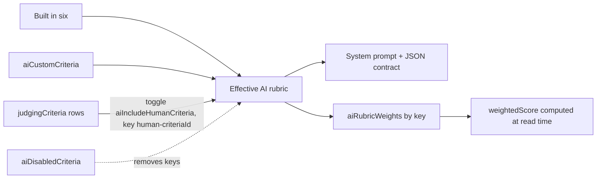

# AI judge reads human Criteria, sees the live UI, and stays consistent through edits

## Answers to your questions first

- **Human Criteria in the AI judge**: not wired today. `getRubricForGroup` in [convex/aiJudge.ts](convex/aiJudge.ts) only knows the built-in six plus `aiCustomCriteria`. Plan below adds a live mirror with a per-group toggle.
- **Show human criteria in Custom AI criteria**: yes, as a read-only "Human judging criteria" block with the toggle. Text stays editable only in the Criteria editor so there is one source of truth.
- **Browser Use component**: skipping per your pick. Instead the existing Firecrawl scrape requests a `screenshot` too and the image is passed to Claude Sonnet 4.5 through the Convex AI gateway (multimodal via the `ai` SDK). No new dependency.
- **Video transcription**: already built in [convex/videoTranscripts.ts](convex/videoTranscripts.ts). Context.dev pulls YouTube caption transcripts (title, channel, duration too); Vimeo, Loom, Drive pages get a page scrape with Firecrawl fallback; direct `.mp4` files are marked unsupported. Capped at 15k chars, cached 7 days per story, injected as "unverified builder narrative" that can never lower a score. Gap: YouTube videos without captions give metadata only. No change planned.
- **Agent judge keys**: a different feature from the AI judge. They let an outside agent (someone running Claude Code or Codex as a judge) call `/api/judging/{slug}/scores` and post scores as an `agent` judge identity, advisory by default. You do not need them for the built-in AI judge; the per-group Agent API toggle can stay off. Docs will state this distinction plainly.

## How the rubric is assembled after this change

Human criteria are scored 1 to 10 by the AI like every other rubric entry. The prompt tells the model the human scale (1 to 5 or 1 to 10) so intent matches, and admins set a separate AI weight per mirrored criterion in the Rubric weights card. Human `weight` on `judgingCriteria` is untouched.

## Backend

- [convex/schema.ts](convex/schema.ts): add `aiIncludeHumanCriteria: v.optional(v.boolean())` to `judgingGroups`; add `screenshot: v.optional(v.boolean())` inside `aiJudgeResults.sourcesUsed`.
- [convex/aiJudge.ts](convex/aiJudge.ts):
  - `HUMAN_CRITERION_PREFIX = "human-"` and `humanCriteriaToRubric(criteria, scoreScale)` mapping `question` to label and `description ?? question` to description with a note that humans score it on the group scale.
  - `getRubricForGroup(group, humanCriteria?)` appends mirrored rows when the toggle is on; the existing "never empty" guard stays.
  - `updateAiRubricWeights` and `updateAiCustomCriteria`: include human keys in `allKeys`/`validKeys` so weights and on/off flags for mirrored criteria validate and are never pruned; reject custom keys starting with `human-`.
  - New `updateAiIncludeHumanCriteria` mutation (judging.ai permission), same shape as the other AI toggles.
  - `getAiPromptConfig`: fetch human criteria and tag rubric rows with `source: "builtin" | "custom" | "human"`.
  - `getSubmissionForAnalysis`: return `aiIncludeHumanCriteria`, `scoreScale`, and the group's `judgingCriteria` (by `by_groupId_order`) so the action needs no extra query.
- [convex/aiJudgeAnalysis.ts](convex/aiJudgeAnalysis.ts):
  - `getRubricForGroup(data, data.humanCriteria)`.
  - `buildSystemPrompt` appends a non-editable rule: `human-` criteria mirror the event's human rubric; judge them from the live app, screenshot, transcript, and repo; a UI-only criterion must not be scored from Convex facts alone.
  - `fetchLiveUrlContext`: request `formats: ["markdown", "screenshot"]`, return `screenshotUrl`. User message gets a `=== LIVE APP SCREENSHOT ===` note when attached.
  - `callJudgeLlm(system, user, imageUrl?)`; attempt 1 sends the image, the existing retry drops it so a bad image can never fail a review. Save `sourcesUsed.screenshot`.
- [convex/lib/llm.ts](convex/lib/llm.ts): optional `imageUrl` builds a `messages` array with text plus image parts instead of `prompt`.
- [convex/judgingCriteria.ts](convex/judgingCriteria.ts): when `saveCriteria` or `deleteCriteria` removes a criterion, prune `human-<id>` entries from the group's `aiRubricWeights` and `aiDisabledCriteria`. Existing AI results keep their stored score and label for that key, so history stays intact.
- [convex/judgingGroups.ts](convex/judgingGroups.ts): `getGroupDetails` returns `aiIncludeHumanCriteria` (it already returns `criteria`).

## Frontend

- [src/components/admin/judging/GroupAiSection.tsx](src/components/admin/judging/GroupAiSection.tsx):
  - `RubricWeightsCard`: when the toggle is on, list `group.criteria` rows tagged `human` with the same weight input and On/Off pill; fix the custom-count check to use `group.aiCustomCriteria.length` instead of `rubricDefs.length - 6`.
  - `CustomCriteriaCard`: add a "Human judging criteria" block at the top: `TogglePill` "Include in AI rubric" (saves immediately), read-only rows showing question, description, and "Humans score 1 to N, AI scores 1 to 10", empty state pointing to the Criteria editor.
  - `SystemPromptCard`: show the `human` tag on mirrored rubric rows.
- [src/components/admin/EditJudgingGroupModal.tsx](src/components/admin/EditJudgingGroupModal.tsx): existing bug, the legacy modal saves only the six built-in weights and would wipe custom and human weights. Merge the group's stored non-built-in entries into `weightsArray` before calling `updateAiRubricWeights`.
- [src/components/admin/AIJudgeResults.tsx](src/components/admin/AIJudgeResults.tsx): no change needed, rows render stored `criteriaScores` labels.

## Docs and tracking

- [src/components/admin/AdminDocs.tsx](src/components/admin/AdminDocs.tsx): in the AI judge section add "Human criteria in the AI rubric" and a "Live app screenshot" bullet; replace the stale provider key table with the Convex AI gateway note (no `ANTHROPIC_API_KEY` etc. are read anymore per `lib/llm.ts`); add a short "AI judge vs Agent judges" paragraph to the Agent judges section. Add one line to Criteria and weights: human weights and AI weights are separate settings.
- Create `prds/ai-judge-human-criteria-screenshot.md`, then sync `TASK.MD`, `changelog.md`, `files.md` with dates from `git log` (2026-09-21) and print a plain commit message.

## Edge cases covered

- Toggle on with zero human criteria: rubric unchanged, block shows an empty state.
- Human criterion edited mid-event: next run uses the new text; stored results keep the label from their run.
- Human criterion deleted: weights pruned, results keep history, `computeWeightedScore` defaults missing weights to 1.
- All criteria disabled or duplicate keys: existing guards extended to human keys.
- Firecrawl not configured or no screenshot returned: identical behavior to today.

## Verification

- `npx convex dev` compiles the schema and functions; `npx tsc -p tsconfig.app.json --noEmit`.
- On a test group: add two human criteria, flip the toggle, confirm they appear in Rubric weights and in the prompt preview, run the AI judge on one submission, confirm `human-` scores render in AI Results and re-rank when their weight changes; delete one human criterion and confirm no error and pruned weights.

## Flagged, not in scope

- The Criteria editor has no weight input even though `judgingCriteria.weight` exists and the docs mention weights. Worth a follow-up if human weighted totals matter for this event.
- Whisper transcription for direct media files and caption-less YouTube videos.
