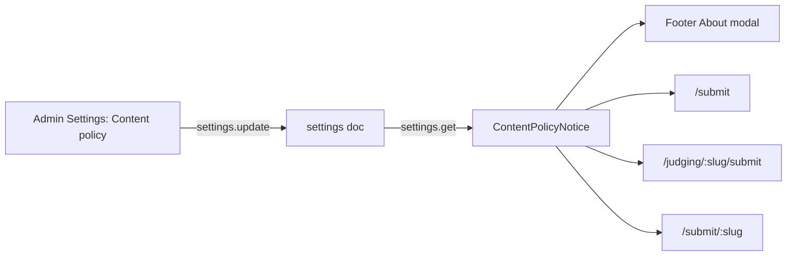

# Content policy notice

## Approach

Store the notice on the existing `settings` doc (same pattern as `hideSubmitPageSidebar`). `api.settings.get` is already public and already queried by every surface, so this needs no new query and adds no extra round trips. A single shared `ContentPolicyNotice` component renders it everywhere, so wording and styling stay identical and the admin edits it in one place.

## Backend

- [convex/schema.ts](convex/schema.ts), `settings` table: add optional fields
  - `showContentPolicy: v.optional(v.boolean())`
  - `contentPolicyText: v.optional(v.string())`
  - `contentPolicyUrl: v.optional(v.string())` for an optional "Read the full policy" link
- [convex/settings.ts](convex/settings.ts)
  - Add these to `DEFAULT_SETTINGS`: enabled `true`, plus a default text: "Share what you built. Keep it clean. Admins and moderators can hide or remove any app, comment, or profile at any time. NSFW, adult, hateful, or illegal content is not allowed. Neither is spam, malware, or anything that collects user data without consent." That way the notice shows up right after deploy, with no migration.
  - Merge the fields in `get`, the same way `hideSubmitPageSidebar` is merged.
  - Add them to the `update` args. In the handler, trim the text, cap it at 1000 characters, and reject a `contentPolicyUrl` that does not start with `https://` or `http://`, so a bad link cannot reach the public pages.

## Admin UI

- [src/components/admin/Settings.tsx](src/components/admin/Settings.tsx): add a "Content policy" section after Submission Limit Settings. It has:
  - A checkbox to show the notice on the About modal and all submit forms.
  - A textarea (1000 characters, with a live counter) for the notice text.
  - An optional URL input for the full policy link.
  - A short preview that uses the same `ContentPolicyNotice` component, so the admin sees exactly what users will see.
- Wire the fields into `DEFAULT_SETTINGS_FRONTEND` and `handleSave` like the other fields. `handleChange` needs to accept `HTMLTextAreaElement`.

## Shared component

- New [src/components/ContentPolicyNotice.tsx](src/components/ContentPolicyNotice.tsx)
  - Props: `text`, optional `url`, `variant: "form" | "modal"`.
  - The form variant is a small muted note (`text-xs text-soft`, `ShieldAlert` icon from lucide, hairline border, `bg-surface-alt`) that follows the tokens in `.interface-design/system.md`. Text uses `whitespace-pre-line` so admin line breaks are kept. It renders as plain text only, with no HTML injection.
  - The link opens in a new tab with `rel="noopener noreferrer"`.
  - It returns `null` when the notice is disabled or the text is empty, so the layout never shows an empty box.
  - It gets `role="note"` for screen readers.

## Placements

- [src/components/Footer.tsx](src/components/Footer.tsx): add `useQuery(api.settings.get)` and render the modal variant under a "Content policy" subheading, after the "drop it here" paragraph.
- [src/components/StoryForm.tsx](src/components/StoryForm.tsx): render the notice just above the `flex gap-4 items-center pt-4 border-t` button row (around line 1220). `settings` is already loaded here.
- [src/pages/JudgingGroupSubmitPage.tsx](src/pages/JudgingGroupSubmitPage.tsx): render it just above the Submit App `Button` (around line 1881) with the already loaded `siteSettings`.
- [src/components/DynamicSubmitForm.tsx](src/components/DynamicSubmitForm.tsx): render it above the submit button (around line 337). This form is a third public submit surface, so leaving it out would be inconsistent. It needs a `useQuery(api.settings.get)`.

## Agent experience

- Add the same policy to [llms.txt](llms.txt) and to `public/vibeapps.md` if it is a static file (check this during implementation), so agents that submit apps see the rule. These are static files, so I will note in files.md that they need a manual update whenever the wording changes.

## Docs (per /update-project-docs and /workflow)

- New PRD [prds/content-policy-notice.md](prds/content-policy-notice.md) with UTC timestamps.
- Update [TASK.MD](TASK.MD), [changelog.md](changelog.md) (use real dates from `git log --date=short`), and [files.md](files.md) (new component).
- Output a plain commit message at the end.

## Verification

- Run `npx tsc -p tsconfig.app.json --noEmit` and `npx convex dev --once` to typecheck.
- Load `/submit`, a judging group submit page, a `/submit/:slug` form, and the About modal, and confirm the notice renders.
- Toggle the setting off in admin and confirm it disappears everywhere in real time.
- Save a bad URL and confirm it is rejected.
