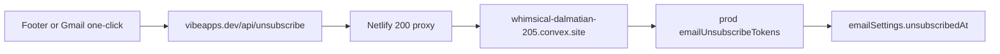

# Unified email footer, unsubscribe fix, and spam review alerts

Docs check is done. Convex HTTP actions live on `.convex.site` (not `.convex.cloud`). Netlify `200` proxies to that host are the supported way to expose them on `vibeapps.dev`. Resend transactional mail does not host your list: you send `List-Unsubscribe` plus `List-Unsubscribe-Post`, accept GET (page) and POST (`200`/`202`), and stop sending within 48 hours. `@convex-dev/resend` stays the send path. Unsubscribe stays custom Convex tokens. `docs.convex.dev/llms.txt` has no Resend changes that affect this.

## What you do after the fix

Nothing in the Resend dashboard for unsubscribe. After Netlify publishes [`public/_redirects`](public/_redirects) and Convex deploys the code:

1. Click the **same** old unsubscribe URL. That GET hit **dev**, so the **prod** token was never consumed. It should succeed once the proxy is corrected.
2. Send one fresh test email from admin, then click Unsubscribe and Manage email preferences.
3. Confirm profile Email Preferences flips to "Currently unsubscribed from all emails".
4. Optional ops check (from the earlier audit, not this bug): prod webhook `https://whimsical-dalmatian-205.convex.site/resend-webhook` and `RESEND_API_KEY` / `RESEND_WEBHOOK_SECRET` on prod.

Local `npx convex dev` is unchanged. Do not run `npx convex deploy` unless you mean to ship Convex prod.

## 1. Unsubscribe actually works

Root cause: [`public/_redirects`](public/_redirects) line 18 proxies `/api/unsubscribe` to **dev** `acoustic-goldfinch-461.convex.site`. Production emails write tokens to **prod** `whimsical-dalmatian-205`. Lookup fails, HTML says "expired".

- Change that one proxy to `https://whimsical-dalmatian-205.convex.site/api/unsubscribe` (same pattern as robots/sitemap in that file).
- Make [`handleUnsubscribeToken`](convex/emails/unsubscribe.ts) **idempotent**: already consumed + user already unsubscribed returns `{ success: true }`. Unknown or truly expired token still fails. Stops Gmail POST then user GET from showing the expired page.
- Keep GET + POST routes. Resend wants GET to show a page and POST to return `200` with a blank body. POST already does that.

## 2. Unified footer for every email

Today the legal footer is copy-pasted in [`convex/emails/templates.ts`](convex/emails/templates.ts) (14 times), submissions hardcode `/profile`, judging/spam shells have no prefs/unsubscribe.

Add helpers in [`convex/emails/render.ts`](convex/emails/render.ts) (already shared by backend + admin preview):

- `emailPreferencesUrl({ userId, username })` never uses `/profile`. Destination is `https://vibeapps.dev/{username}#email-preferences` (same public profile URL the app already uses). Logged-out uses `/sign-in?redirect_url=` plus a **relative** path (`/{username}#email-preferences`) so [`sanitizeRedirectPath`](src/lib/redirectPath.ts) accepts it. No username: `/set-username`. "View Your Profile" CTAs stay `/{username}` with no hash.
- `standardEmailFooter({ userId, username, unsubscribeToken })` with this copy:
  - Contact us (GitHub issues, unchanged)
  - Clickable **Manage email preferences** and **Unsubscribe** (not the current "from your profile page" sentence)
  - `VibeApps is an open-source project maintained by WayneSutton.ai` linking to `https://waynesutton.ai/`
  - Convex legal address (CAN-SPAM, keep)
  - Existing Twitter / LinkedIn / GitHub line

Wire that footer into:

- All generators in [`convex/emails/templates.ts`](convex/emails/templates.ts)
- [`templateEmailShell`](convex/emails/render.ts) (judging group + template preview)
- [`convex/emails/submissions.ts`](convex/emails/submissions.ts)
- [`convex/emails/spam.ts`](convex/emails/spam.ts)

Judging recipients are `{ name, email }` only. Look up the user by email when sending; if found, generate a token and pass it to `sendEmail` so List-Unsubscribe is set. If not found, still render Manage preferences via sign-in.

## 3. Profile prefs link actually lands (without stealing `/:username`)

- Add `id="email-preferences"` on the Email Preferences card in [`src/pages/UserProfilePage.tsx`](src/pages/UserProfilePage.tsx) and scroll to it when the hash is present. Hash is never sent to the server.
- **Do not add a `/profile` SPA route.** [`App.tsx`](src/App.tsx) already uses `/:username` last among Layout children. A new `/profile` route would sit in front of that catch-all and break a real user named `profile`. Header, StoryList, mentions, inbox, and leaderboard keep linking to `/${username}`.
- Clerk `/user-settings` stays account security. Email prefs stay on the Convex profile. No Clerk change.

## Safety: what this does not touch

Profile links, story OG images, and crawler meta stay as they are.

- **Public profiles:** still `https://vibeapps.dev/{username}`. `#email-preferences` is a fragment only. Browsers and crawlers request the same path they do today.
- **In-app profile links:** [`Layout.tsx`](src/components/Layout.tsx) `profileUrl`, StoryList, StoryDetail, mentions, inbox, search, admin user links: unchanged.
- **Story OG / Twitter cards:** [`netlify.toml`](netlify.toml) edge functions stay `/s/*` (`botMeta`) and `/judging/*/submit` (`submitMeta`). Those still call [`convex/http.ts`](convex/http.ts) `/meta/s` and `/meta/submit`. [`StoryDetail.tsx`](src/components/StoryDetail.tsx) client `og:image` updates: unchanged. [`index.html`](index.html) default OG image: unchanged.
- **Netlify `_redirects`:** only the `/api/unsubscribe` **target host** changes (dev goldfinch to prod dalmatian). `robots.txt`, `llms.txt`, `vibeapps.md`, `sitemap.xml`, `/md/*`, `/s/:slug/llms.txt`, and the SPA `/*` fallback stay pointed at prod. Query strings keep forwarding.
- **HTTP routes:** `/api/unsubscribe` GET/POST already exist. No new path that could steal `/s/...`, `/judging/...`, or `/meta/...`.
- **Unsubscribe idempotency:** only changes the token mutation return when the user is already unsubscribed. It does not change story, user, or profile tables.
- **Spam review email / alerts:** new optional type plus a count chip. Mark, unmark, hide, delete, and Request review stay the same mutations. Request review stays idempotent (one stamp per mark).

## 4. Request review: admin spam tab + email

[`requestSpamReview`](convex/spamCheck.ts) already stamps `spamReviewRequestedAt`, logs Activity, and the spam tab already shows an amber **Review requested** badge and sorts disputed rows first. What is missing: admins are not emailed, and there is no tab-level count.

Match the existing report flow in [`convex/alerts.ts`](convex/alerts.ts):

- From `requestSpamReview` (first request only, still idempotent): create in-app alerts for admin/manager IDs from `getAdminUserIds`, then `ctx.scheduler.runAfter(0, ...)` an internal action that emails those admins.
- New email type `spam_review_request` in [`convex/emails/emailTypes.ts`](convex/emails/emailTypes.ts), schema `emailLogs` union, and [`insertEmailLog`](convex/emails/queries.ts). Default **on**, still behind the global `emailsEnabled` kill switch. New toggle row under Admin in [`EmailManagement.tsx`](src/components/admin/EmailManagement.tsx): "Spam review requests".
- Template: story title, submitter, spam reason, auto-mark flag, CTA to `/admin?tab=spam`. Same unified footer + unsubscribe token as other admin alerts.
- Skip admins with `emailSettings.unsubscribedAt`.
- Header dropdown + notifications: add alert type `spam_review` (schema `alerts.type` union + Layout/NotificationsPage copy). Link goes to `/admin?tab=spam`. Reuse existing `report` styling. Semantic amber already used on the spam tab; keep that, no new palette.
- Spam tab UX (does not change scan/mark/unmark): a count chip "N review requested" that filters the marked-spam list to disputed rows. Same CountPill pattern already on scan results.

## Why these UI choices

- Amber badge already means "needs a human". A count chip is the same language, not a new status system.
- Header alert matches content reports, so mods see a dispute without opening the spam tab.
- Footer links are real actions. The screenshot line that only _describes_ unsubscribing is why Manage preferences felt broken even when the profile page existed.
- Site About already says maintained by Wayne Sutton. Email footer catching up is consistency, not a new brand.

## Out of scope (on purpose)

- Granular daily/weekly/mention toggles on the profile card (schema exists, product is still all-or-nothing).
- Resend Audiences / `{{{RESEND_UNSUBSCRIBE_URL}}}`.
- CSPRNG token rewrite (already on the security backlog).
- Changing site [`Footer.tsx`](src/components/Footer.tsx) (already has WayneSutton.ai).
- Adding a `/profile` SPA route (would collide with `/:username`).

## Tracking

PRD: `prds/email-footer-unsubscribe-spam-review.md`. After implementation, sync `task.md`, `changelog.md`, `files.md` per `/update-project-docs`.
