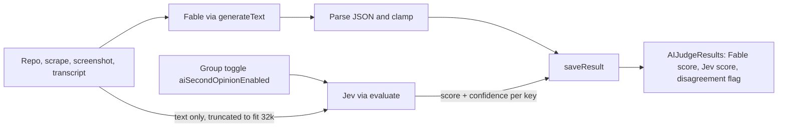
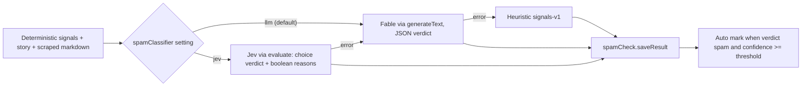

# Fable as primary judge, Jev as second opinion

## Why this shape

The app already calls the Convex AI Gateway, but only through the chat door (`convexGateway(model)` + `generateText`). Fable is behind that door, so it is a string swap. Jev is behind the decisions door (`convexGateway.evaluationModel` + `experimental_evaluate`), returns numbers only, takes no images, and has a 32k token window. So Fable keeps the full context, screenshot, and written reasoning; Jev adds a calibrated score plus `confidence` per criterion that admins can compare against.



## Phase 1: Fable via env var

- [convex/lib/llm.ts](convex/lib/llm.ts): replace the constant at line 16 with a runtime read so the model can be flipped from the Convex dashboard without a deploy:
  ```ts
  const FALLBACK_LLM_MODEL = "anthropic/claude-fable-5";
  function resolveLlmModel(): string {
    return process.env.AI_JUDGE_MODEL?.trim() || FALLBACK_LLM_MODEL;
  }
  ```
  `callLlm` uses `resolveLlmModel()`. Spam check and group summary share this path, so all three move together. Stored `judgeProvider` and `judgeModel` keep labeling history correctly.
- Set `AI_JUDGE_MODEL=anthropic/claude-fable-5` on dev and prod with `npx convex env set` (fallback covers it if unset).
- [src/components/admin/AdminDocs.tsx](src/components/admin/AdminDocs.tsx) line 579: replace `anthropic/claude-sonnet-4.5` with the env var name and Fable default, and note that any id from the gateway model list works.

## Phase 2: Jev second opinion (advisory only, per group toggle)

Organizers turn it on per judging group, the same way `aiIncludeHumanCriteria` works today, so cost and the alpha risk are opt in per event. No deployment env var.

### Packages

- Bump `ai` from 7.0.79 to `^7.0.109` and `@convex-dev/ai-sdk-provider` from 0.1.0 to `^0.2.1` (0.2.1 adds `convexGateway.evaluationModel` and fixes Jev rounding validation; it peers on `ai ^7.0.105`). Confirm `generateText` with the image part still typechecks.

### Backend

- [convex/lib/llm.ts](convex/lib/llm.ts): add `JEV_MODEL = "typesafe/jev-1.13"` and `evaluateRubric(state: string, rubric)` that builds one `score` question per rubric key using 5 ordered levels derived from the criterion description (poor to exceptional), calls `experimental_evaluate({ model: convexGateway.evaluationModel(JEV_MODEL), state, questions })`, and returns `Array<{ key, score, confidence? }>` with `score` normalized to the 1 to 10 scale. Verify Jev's `score` indexing (0 or 1 based) on the first real call and normalize accordingly.
- [convex/schema.ts](convex/schema.ts) `judgingGroups`: add `aiSecondOpinionEnabled: v.optional(v.boolean())` next to `aiIncludeHumanCriteria` (line 676). Stored as `true` or unset, matching the other AI toggles.
- [convex/aiJudge.ts](convex/aiJudge.ts): new `updateAiSecondOpinionEnabled` mutation, a copy of `updateAiIncludeHumanCriteria` (line 909) with `requireJudgingGroupPermission(ctx, groupId, "judging.ai")` and `patch({ aiSecondOpinionEnabled: enabled ? true : undefined })`. `getSubmissionForAnalysis` (line 1455 validator, line 1502 return) adds `aiSecondOpinionEnabled` so the action needs no extra query.
- [convex/judgingGroups.ts](convex/judgingGroups.ts) `getGroupDetails`: return `aiSecondOpinionEnabled` beside `aiIncludeHumanCriteria` (lines 900 and 1022) so the admin UI can render the toggle.
- [convex/aiJudgeAnalysis.ts](convex/aiJudgeAnalysis.ts) in `analyzeSubmission` after the Fable parse succeeds (around line 2223): when `data.aiSecondOpinionEnabled === true`, build `state` from `userMessage` with the repo file section truncated to roughly 80k chars (deterministic facts sections stay intact), call `evaluateRubric` inside its own try/catch, and pass `secondOpinion: { model, scores, truncated }` to `saveResult`. Any Jev error is logged and the review still completes.
- [convex/schema.ts](convex/schema.ts) `aiJudgeResults`: add
  ```ts
  secondOpinion: v.optional(v.object({
    model: v.string(),
    truncated: v.boolean(),
    scores: v.array(v.object({ key: v.string(), score: v.number(), confidence: v.optional(v.number()) })),
  })),
  ```
- [convex/aiJudge.ts](convex/aiJudge.ts) `saveResult` (line 1522): accept optional `secondOpinion` in the success outcome and patch it (write `undefined` when absent so reruns clear stale values). Include it in the results returned by `enrichResults` and the `getResultsForGroup` return validator. Ranking and `weightedScore` are untouched.

### Frontend

- [src/components/admin/judging/GroupAiSection.tsx](src/components/admin/judging/GroupAiSection.tsx): add a "Second opinion (Jev)" block modeled on the Human judging criteria block (line 765 onward): title, one sentence explaining it scores the same rubric from text only, is advisory, and never changes ranking, plus a `TogglePill` (`onLabel="On"`, `offLabel="Off"`) calling `updateAiSecondOpinionEnabled` with the same pending and error handling. Place it under the Custom AI criteria card so all AI judge switches live together.
- [src/components/admin/AIJudgeResults.tsx](src/components/admin/AIJudgeResults.tsx): add `secondOpinion` to the result type; in the criteria row next to `{cs.score}/10` (line 1862) render a muted `Jev {score}/10 · {confidence}%` when present and a small "disagrees" badge when the gap is 3 or more. Show a "context truncated" hint when `truncated` is true. No changes to ranking, export text, or edit mode.
- [src/components/admin/AdminDocs.tsx](src/components/admin/AdminDocs.tsx): short "Second opinion (Jev)" bullet in the AI judge section: advisory only, alpha, turned on per group in the AI judge settings, text only context, never changes ranking.

## Phase 3: Jev as the spam classifier (opt in, site wide)

The spam check is a three way classification with a confidence number that already drives auto mark. That is exactly Jev's `choice` shape: a real probability per verdict instead of a model guessing "confidence: 85". Opt in through the existing spam automation settings so the current Fable path stays the default.



### Backend

- [convex/spamCheck.ts](convex/spamCheck.ts): add a `SPAM_CLASSIFIER_KEY` appSettings row read in `readAutomationSettings` (line 57) as `spamClassifier: "llm" | "jev"` with default `"llm"`. Extend `automationValidator`, `getSpamAutomation`, and `setSpamAutomation` (lines 544 to 629) to accept and log the new field with the same `upsertSetting` and `logActivity` pattern. Add an `internalQuery` `getSpamClassifierInternal` (or fold it into `getSpamPromptInternal`) so the action reads it in one call. `saveResult` is unchanged; `provider` and `model` come from the analysis.
- [convex/lib/llm.ts](convex/lib/llm.ts): add `classifySpam(instructions: string, state: object)` that calls `experimental_evaluate` with `convexGateway.evaluationModel(JEV_MODEL)` and these questions:
  - `verdict`: `choice` with `criteria` `spam`, `suspicious`, `clean` (descriptions pulled from the same definitions the default spam prompt uses). The admin edited system prompt is passed as this question's `instructions`, so the existing prompt editor keeps working with Jev.
  - A small fixed set of `boolean` questions that become the `reasons` list when their probability is 0.7 or higher: `deadOrPlaceholderUrl`, `emptyOrMissingRepo`, `descriptionIsGibberishOrTemplate`, `promotionalOrUnrelatedContent`, `linksPointElsewhere`. Each maps to a fixed reason string, so the Spam tab keeps showing short reasons.
  - Returns `{ verdict, confidence, reasons, probabilities }` where `confidence = round(probabilities[verdict] * 100)`.
- [convex/spamCheckAnalysis.ts](convex/spamCheckAnalysis.ts) in `analyzeStory` around line 470: when `spamClassifier === "jev"`, build a JSON `state` from `story` fields, `signals`, and `scrapedMarkdown` capped so the whole state stays under roughly 80k chars, call `classifySpam` inside try/catch. On success save `provider: "typesafe"`, `model: "typesafe/jev-1.13"`, `llmReasoning` as a one line probability summary (`spam 0.82, suspicious 0.12, clean 0.06`). On Jev failure fall through to the existing `callLlmOrNull` path, then the heuristic, so behavior can only degrade to what runs today. `parseVerdictResponse` and `heuristicVerdict` are untouched.

### Frontend

- [src/components/admin/SpamCheck.tsx](src/components/admin/SpamCheck.tsx): add an `AutomationToggle` "Use Jev decisions model" to the automation panel (after line 823) with the description that it returns a calibrated probability per verdict, that the confidence threshold below now compares against that probability, and that the system prompt becomes Jev's verdict instructions. Toggling calls `setSpamAutomation({ spamClassifier })`. The result footer at line 1298 already prints `Verdict by typesafe (typesafe/jev-1.13)`; no change there.
- [src/components/admin/AdminDocs.tsx](src/components/admin/AdminDocs.tsx) line 708: add one sentence on the Jev option and that its confidence is a true probability, which makes the auto mark threshold more meaningful.

## Tracking

- Update `changelog.MD` and `files.MD` with the real date from `git log --date=short`.

## Verification

- `npx tsc -p tsconfig.app.json --noEmit` and `npx convex dev --once` compile clean after the package bumps.
- On a test group, flip the Second opinion toggle on and run the AI judge on one submission: result row shows `judgeModel: anthropic/claude-fable-5`, `secondOpinion.scores` has one entry per rubric key, UI shows both scores, and ranking equals the Fable only ranking.
- Flip the toggle off, rerun, confirm `secondOpinion` is cleared and the review succeeds. Confirm a group with the toggle unset behaves exactly as today.
- Spam: with the classifier set to Jev, rescan one clean and one obviously spammy submission. Confirm `provider: typesafe`, a verdict with probabilities in `llmReasoning`, reasons only for booleans at 0.7 or higher, and that auto mark fires only for a spam verdict at or above the threshold. Set the classifier back to LLM and confirm the Fable path and its prompt still run.

## Flagged, not in scope

- `convex/tmpVerifyHumanCriteria.ts` is an untracked leftover from the previous task; left alone here.
