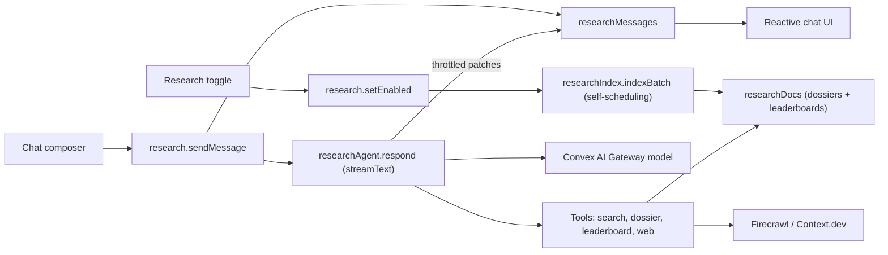

# Judging group research chat

## What you get

- A new **Research** item in the judging group sidebar (`/admin/judging/:slug?section=research`).
- An off-by-default toggle. Turning it on builds a research index of that group only. A live progress bar shows how many submissions are done, and the chat unlocks with a "Ready" notice when indexing finishes.
- A ChatGPT/Claude-style chat with streaming answers. It knows every submission (links, repo, video, socials, team, form answers), every human judge score and comment, completion status, notes, and every AI judge result (scores, reasoning, repo/git facts, URL checks, social proof).
- Shared threads, so every admin with access sees the team's research history, with author names.
- On each answer: a copy button, a "Download .md" button, a list of tool steps (for example "Searched submissions", "Read leaderboard", "Searched the web"), web sources with links, and the model that answered. You can also export a whole thread as Markdown.
- Suggested prompts for an empty thread: compare the human top 10 with the AI top 10; who should win and why; where humans and the AI disagree most; pick a top 3 with links; flag weak evidence (dead links, empty repos); summarize judge feedback for the top 5.

## Architecture

## Key decisions

- **Indexing runs in mutations, not actions.** All the data is already in Convex, so `indexBatch` is an internal mutation that processes about 25 submissions per run and schedules the next batch with a cursor. It is transactional, retries safely, and has no extra cost. The last batch writes the human, AI, and combined leaderboard docs.
- **Hybrid context.** The system prompt gets a compact digest: group overview, criteria and weights, judge completion stats, the full human and AI leaderboards, and a roster with ids and links. Detail comes through tools. `get_submissions` rebuilds dossiers from **live** data with the same builder as the index, so answers about specific submissions are always current.
- **Streaming without a new component.** The action calls AI SDK `streamText` with `convexGateway(model)` and patches the assistant message about every 250ms. The UI updates reactively through `useQuery`. A Stop button sets a flag that the flush checks, which then aborts the stream with an `AbortController`.
- **Staleness.** A small `markResearchStale(ctx, groupId)` helper, which only patches when an index exists, is called where scores, AI results, or group membership change. The UI then shows "New data since last index" with a Refresh button.
- **Permissions.** The chat shows both human and AI results, so it requires `judging.results` and `judging.ai`. Full admins bypass this. Checks use the existing `requireJudgingGroupPermission`.
- **Turning it off** deletes the index docs and blocks new messages. Existing threads stay visible as read-only history.
- **Model picker.** A curated allowlist lives in `convex/lib/researchModels.ts` and is imported by both the backend and the UI. It includes Claude Opus 5.5, Claude Sonnet 5.5, Claude Fable 5.1, GPT 6.1 Sol, Gemini 3.8 Flash, and Grok 4.7. The default comes from a new optional `AI_RESEARCH_MODEL` env var, then `resolveLlmModel()`. The server rejects ids that are not on the list.
- **Web tools.** `web_search` uses Firecrawl component `search()` and falls back to Context.dev `search()`. `read_url` uses Firecrawl `scrape` and falls back to Context.dev `scrapeMarkdown`. Output is truncated. Both reuse the existing `FIRECRAWL_API_KEY` and `CONTEXT_DEV_API_KEY`.
- **Rate limits.** A per-user send limit (for example 40 per hour) uses the existing `@convex-dev/rate-limiter`.

## Backend changes

- [convex/schema.ts](convex/schema.ts):
  - On `judgingGroups`, add `researchEnabled?` and `researchModel?`.
  - `researchIndexes`: status (`indexing | ready | failed`), processed and total counts, `cursor`, `startedAt`, `readyAt`, `staleSince?`, `error?`. Index: `by_groupId`.
  - `researchDocs`: `groupId`, `storyId?`, `kind` (`overview | submission | humanLeaderboard | aiLeaderboard | combinedLeaderboard`), `title`, `content`. Indexes: `by_groupId_and_kind` and `by_groupId_and_storyId`. Search index `search_content` filtered by `groupId`.
  - `researchThreads`: `groupId`, `title`, `createdBy`, `createdByName`, `lastMessageAt`. Index: `by_groupId_and_lastMessageAt`.
  - `researchMessages`: `threadId`, `groupId`, `role`, `content`, `status` (`pending | streaming | done | failed | stopped`), `model?`, `toolSteps?`, `sources?`, `authorName?`, `error?`, `usage?`. Index: `by_threadId`.
- New [convex/lib/researchDossier.ts](convex/lib/researchDossier.ts): pure builders that take a story, human scores, criteria, notes, AI result, social proof, and transcript and return a Markdown dossier, plus leaderboard and digest builders. The human ranking logic is extracted from `judgeScores.getGroupScores`, and AI ranking reuses [convex/lib/aiRank.ts](convex/lib/aiRank.ts).
- New [convex/research.ts](convex/research.ts), public with validators:
  - Mutations: `setEnabled`, `refreshIndex`, `setModel`, `createThread`, `renameThread`, `deleteThread`, `sendMessage`, `stopMessage`, `retryMessage`.
  - Queries: `getStatus`, `listThreads`, `listMessages`.
  - Toggles and refreshes are logged with the existing `logActivity`.
- New [convex/researchIndex.ts](convex/researchIndex.ts): `indexBatch` internal mutation and `markResearchStale` helper.
- New [convex/researchAgent.ts](convex/researchAgent.ts): `respond` internal action using `streamText`, `stopWhen: stepCountIs(8)`, and these zod tools: `search_submissions`, `get_submissions`, `get_leaderboard`, `web_search`, `read_url`. It also has internal queries and mutations for context loading, `appendChunk` (which returns a stop flag), `recordToolStep`, and `finish`/`fail`. The system prompt tells the model to answer in GFM Markdown, link every submission, cite whether a claim comes from human judges, the AI judge, or the web, and never invent scores.
- [convex/convex.config.ts](convex/convex.config.ts): add `AI_RESEARCH_MODEL: v.optional(v.string())`.
- Stale hooks: add one-line `markResearchStale` calls in score submit and edit paths (`judgeScores.ts`, `adminJudgeTracking.ts`), `aiJudge.saveResult` and `updateResultScore`, and add/remove in `judgingGroupSubmissions.ts`.
- [convex/judgingGroups.ts](convex/judgingGroups.ts) `deleteGroup`: also delete the group's research index, docs, threads, and messages.

## Frontend changes

- [src/pages/AdminJudgingGroupPage.tsx](src/pages/AdminJudgingGroupPage.tsx): add a `research` section with a lucide `Telescope` icon. Visible when `can("judging.results") && can("judging.ai")`.
- New [src/components/admin/judging/GroupResearchSection.tsx](src/components/admin/judging/GroupResearchSection.tsx) with three states:
  - **Off:** an explainer card that lists what gets indexed, plus the toggle.
  - **Indexing:** a progress bar with counts.
  - **Ready:** a status chip ("42 submissions indexed, 3 min ago"), a stale banner with Refresh, the model picker, and the toggle.
- New `src/components/admin/research/` components:
  - `ResearchThreadList`: shared threads with author and time, new thread, rename, delete. Delete uses the site's own confirmation modal, not a browser dialog.
  - `ResearchChat`: message list with auto-scroll and suggested prompt chips.
  - `ResearchMessage`: renders through the existing [src/components/Markdown.tsx](src/components/Markdown.tsx), which already supports GFM tables. Includes copy, download .md, tool step chips, sources, model label, Stop while streaming, and Retry on failure.
  - `ResearchComposer`: auto-growing textarea. Enter sends and Shift+Enter adds a new line. Disabled until the index is ready.
- Use Sonner toasts for "Research index ready" and for errors. Follow the existing design tokens (`text-ink`, `text-soft`, `bg-surface-alt`), keep the black and white style, and use no purple or emoji.

## Docs and tracking

- Create the PRD `prds/judging-research-chat.md` before coding.
- After verification, update `TASK.MD`, `changelog.md` (dates from `git log --date=short -n 10`), and `files.md`, then print a commit message.

## Verification

- `npm run typecheck:convex`, `npm run typecheck`, `npm run lint`, and a clean `npx convex dev` push.
- Manual browser test on a group:
  - Toggle on and watch progress reach Ready.
  - Ask "compare human top 10 vs AI top 10" and confirm links and scores match the Results and AI results sections.
  - Ask a web question and confirm sources render.
  - Test Stop, Retry, copy, and download .md.
  - Submit a score in another tab and confirm the stale banner appears.
  - Toggle off and confirm threads become read-only.
- Confirm the other sections (Results, AI results, Tracking, judging interface) behave the same as before.
