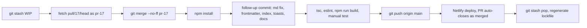

# Merge PR #17 and polish submission downloads

## Verdict: merge it

[PR #17](https://github.com/waynesutton/vibeapps/pull/17) by cuevaio is clean and mergeable against `main` (`7f17164`, unchanged since Aug 30). It is frontend only: no Convex API, schema, or auth changes, so no `npx convex deploy` and nothing to revisit in Convex docs.

What it does well:

- Moves the export out of the manage-only Submissions card into the **View submissions** toolbar (one place, next to the roster it exports). Button is gated client side with `can("judging.results")`, matching the backend `requireJudgingGroupPermission(..., "judging.results")` in [convex/judgingGroupSubmissions.ts](convex/judgingGroupSubmissions.ts).
- Adds JSON and per-submission Markdown (ZIP), hardens CSV (formula prefix, CRLF, BOM), lazy loads `jszip` so the main bundle is unchanged.
- Extracts pure builders into `src/lib/submissionDownloads.ts` (typed off `FunctionReturnType`), which is good DX and testable.

What needs a follow-up before it ships:

- **Defect**: `escapeMarkdown` is applied to `longDescription`, but that field is already Markdown (rendered with `<Markdown>` at [src/components/StoryDetail.tsx](src/components/StoryDetail.tsx) line 1022). Every `#`, `*`, `-`, `.`, `(`, `)` gets a backslash, destroying the author's formatting and making the file worse for agents. It also over-escapes short fields (`.` and `-` in taglines).
- No `changelog.md`, `files.md`, `TASK.MD` updates (repo convention).
- Success feedback is an inline span; the sibling `GroupActivitySection` uses `sonner` toasts.

Keep `jszip` as the contributor chose (proven, lazy loaded). `fflate` would be a lighter zero-dep swap; noted as a later option, not part of this.

## Sequencing with the in-progress team fix

The working tree has staged WIP from the "Ship team fix" plan (`package.json`, lockfile, `ContentModeration.tsx`, `StoryDetail.tsx`, PRDs, docs) and its backend half in `convex/stories.ts` is not done. That work must not ride along. Stash it, do the merge, restore it after.

## Step 1: Bring the PR in locally

- `git stash push -m "wip: team member email fix"` (staged adds included).
- `git fetch origin pull/17/head:pr-17`
- `git merge --no-ff pr-17 -m "Merge pull request #17 from cuevaio/feat/submission-download-formats"`. A true merge keeps cuevaio's two commits and attribution, and GitHub marks the PR merged on push.
- `npm install` to pull `jszip`.

## Step 2: Follow-up commit (polish, not rewrite)

`src/lib/submissionDownloads.ts`

- Replace the blanket `escapeMarkdown` with a light `escapeInline` for single-line fields only (escape `\`, backtick, `*`, `_`, `[`, `]`, `<`, `>`, `|`; collapse newlines to spaces). Do not escape `.`, `-`, `(`, `)`, `#`, `!`.
- Write `longDescription` raw under a `## Description` heading. It is already Markdown.
- Add YAML frontmatter to each file (`title`, `slug`, `url`, `tags` list, `votes`, `teamName`, `submitter`), values JSON-quoted. Machine parseable for agents and static site tools.
- Add a `README.md` index to the zip: group name, export timestamp, count, and `- [Title](01-slug.md)` links. Zip becomes self describing.

`src/components/admin/judging/SubmissionDownloadControl.tsx`

- Swap the inline `message` span for `toast.success("Downloaded N submissions as CSV")` and `toast.error(...)`, matching [GroupActivitySection.tsx](src/components/admin/judging/GroupActivitySection.tsx). Keep `aria-busy` and the Preparing state.

Docs (dates from git: PR commits 2026-09-03, follow-up on today's commit date)

- `changelog.md` Unreleased: Added entry for JSON and Markdown downloads and the toolbar move; Changed entry for CSV hardening; credit cuevaio and link PR #17.
- `files.md`: add `src/lib/submissionDownloads.ts` and `SubmissionDownloadControl.tsx`; update the `GroupSubmissionsSection.tsx` line (drop "and CSV export"), the `GroupSubmissionsTableSection.tsx` line (add Download control), and the `exportGroupSubmissions` description (CSV, JSON, Markdown).
- `TASK.MD` Recently Completed entry.
- `README.md` line 68 area: mention submission downloads in CSV, JSON, or Markdown.

## Step 3: Verify

- `npx tsc --noEmit -p tsconfig.app.json` (no new errors in touched files)
- `npx eslint src/lib/submissionDownloads.ts src/components/admin/judging/SubmissionDownloadControl.tsx src/components/admin/judging/GroupSubmissionsTableSection.tsx src/components/admin/judging/GroupSubmissionsSection.tsx`
- `npm run build`, confirm `jszip` lands in its own chunk.
- With `npx convex dev` running: open a group, View submissions, download all three formats; open one `.md` and confirm the description renders as the author wrote it; confirm the Submissions (manage) section still adds and syncs; confirm a `judging.view` only user does not see Download.

## Step 4: Ship and restore

- `git push origin main`. Netlify rebuilds the frontend. No Convex deploy.
- `gh pr comment 17` with a short thanks and what changed in the follow-up.
- `git stash pop`. If `package-lock.json` conflicts: `git checkout HEAD -- package-lock.json && npm install` so the lockfile carries both `jszip` and the resend/workpool bumps. Confirm the team fix WIP is back and still uncommitted.
