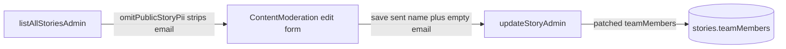

# Ship team member fix and component upgrade

## Current state

- Local `main` equals GitHub `main` (`7f17164`). Nothing unpushed.
- Uncommitted on disk: `package.json` and lockfile (resend 0.2.6 to 0.2.7, workpool 0.3.2 to 0.4.10), frontend team-member fix in [src/components/admin/ContentModeration.tsx](src/components/admin/ContentModeration.tsx) and [src/components/StoryDetail.tsx](src/components/StoryDetail.tsx), and the untracked [prds/convex-filter-query-refactor.md](prds/convex-filter-query-refactor.md).
- The backend half of the team fix never landed. `updateStoryAdmin` in [convex/stories.ts](convex/stories.ts) still requires `email: v.string()` (line 1891), so the new frontend payload `{ name }` would fail validation.
- Prod Convex still runs the old components. [netlify.toml](netlify.toml) only runs `npm run build`; Convex prod only updates on a manual `npx convex deploy`.
- Prod OCC retries dropped 101 to 28 over 72h from lower email volume, not from a fix.

## Why emails were being wiped



The fix keeps stripping on read (PII stays out of the client) and makes the write side merge instead of overwrite.

## Step 1: Backend fix in `convex/stories.ts` (`updateStoryAdmin` only)

- Arg validator: change `email: v.string()` to `email: v.optional(v.string())` inside the `teamMembers` array (line ~1891). Leave the `submit` and user `updateStory` validators and the schema untouched; schema keeps `email: v.string()`.
- Handler: replace the direct assignment at line ~1982 with a merge by index against `story.teamMembers`. A member arriving without `email` keeps the stored address; a member with no stored address gets `""` so the schema stays satisfied. An explicit `email: ""` from the admin still clears on purpose.

```ts
// Merge by position: the admin form only ever receives names (emails are
// stripped as PII), so a member without email keeps the stored address.
if (args.teamMembers !== undefined) {
  const existing = story.teamMembers ?? [];
  updateData.teamMembers = args.teamMembers.map((member, i) => ({
    name: member.name,
    email: member.email ?? existing[i]?.email ?? "",
  }));
}
```

- Do not touch any `.filter(` call sites or anything else in the file.

## Step 2: Keep the frontend diff as is

The existing uncommitted changes in `ContentModeration.tsx` (`teamMembersDirty`, optional `email`, "Email hidden, leave blank to keep" placeholder) and `StoryDetail.tsx` (`member.email?.trim()`) are correct once the backend accepts optional email. No further UI changes.

## Step 3: Verify locally before commit

- `npx tsc --noEmit -p convex/tsconfig.json`
- `npx tsc --noEmit -p tsconfig.app.json` (pre-existing unrelated errors are known; confirm none are new in touched files)
- `npm run build`
- `npx eslint convex/stories.ts src/components/admin/ContentModeration.tsx src/components/StoryDetail.tsx`
- With `npx convex dev` running: open Content Moderation, edit a hackathon story, change only the title, save, then confirm in the dashboard data view that `teamMembers[].email` is unchanged. Then edit a member email and confirm it saves. Confirm screenshot and additional image edits still work (no code in that path changed).

## Step 4: Small PRD and pause note

- Create `prds/admin-team-member-email-fix.md` with problem, root cause, solution, files, edge cases (index merge on count shrink/grow, explicit empty string clears), verification, and a completion log.
- In `prds/convex-filter-query-refactor.md`, change `Status: Draft` to `Status: Paused` with a one-line note. No other changes.

## Step 5: Docs sync and commit message

- `TASK.MD`: add the completed entry under Recently Completed; add a To Do line for the paused filter refactor.
- `changelog.md`: Fixed entry for the team email wipe, Changed entry for the component bump. Real dates from `git log` (component bump and PRD draft were 2026-08-30 and 08-31; the fix lands on the commit date).
- `files.md`: add the two PRD files.
- Print a plain commit message for you to copy. Suggested subject: `fix: keep team member emails on admin edit`.

## Step 6: Deploy (you run these)

1. Commit and push to `main`. Netlify rebuilds the frontend.
2. `npx convex deploy` to push the 0.4.10 workpool and 0.2.7 resend to `whimsical-dalmatian-205`.

## Step 7: Post-deploy checks

- Send a test email from the admin Email dashboard.
- Submit one story so `autoScanStory` runs through the spam workpool.
- Edit a hackathon story in prod admin and confirm team emails survive.
- A few hours later: `npx convex insights --prod`. Success is retries in the low tens and zero `OCC Failed Permanently`.

## Out of scope (on purpose)

- The `.filter()` refactor PRD. Paused.
- `@waynesutton/agent-ready` 0.3.0 bump. Its peer still pins workpool `^0.3.0`, so it would not clear the npm warning and adds risk.
- Any schema change, upload path change, or public query change.
