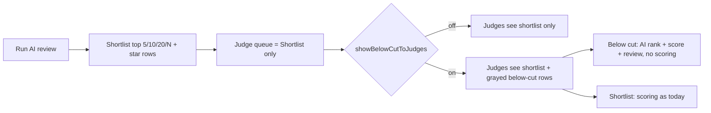

# Shortlist below the cut

## What already exists (build on, do not duplicate)

- `judgingGroups.judgeQueueMode: "all" | "shortlist"` and `judgingGroupSubmissions.shortlisted` in [convex/schema.ts](convex/schema.ts).
- `shortlistTopByAiScore` (top N by weighted score, ties included) and `setShortlisted` (manual star) in [convex/judgingGroupSubmissions.ts](convex/judgingGroupSubmissions.ts).
- One queue rule: `isInJudgeQueue` in [convex/lib/judgeQueue.ts](convex/lib/judgeQueue.ts), used by `getGroupSubmissions`, `getJudgeProgress`, agent `submissions.json`, and results denominators.
- `aiReviewVisibleToJudges` gate plus `AiReviewCard` and `getAiReviewForJudge` in [convex/aiJudge.ts](convex/aiJudge.ts).
- AI ranking is derived at read time by a sort inside `enrichResults` (weightedScore, then componentsUsed, depth, `_creationTime`).

Today shortlist mode simply hides below-cut rows from judges. This plan makes that a choice.

## Decisions (confirmed)

- New group toggle `showBelowCutToJudges` (default off = current behavior). Only meaningful when `judgeQueueMode === "shortlist"`.
- Judge default view stays the shortlist queue. A queue filter (Shortlist / Below the cut / All) and a "N below the cut" pill expose the rest.
- Below-cut rows are read only: no score buttons, no Skip/Complete/Judged & Next, `canJudge = false`. Notes stay allowed so judges can tell organizers "this one deserves a second look."
- Below-cut rows always show AI rank, average and weighted score, and the AI review card (that is the point of showing them). For shortlisted rows the AI badge and card follow the existing `aiReviewVisibleToJudges` toggle. A judge-side Show/Hide AI scores switch (localStorage, per group) hides badges and the card locally.
- Agent judges (`submissions.json`) keep the narrowed queue. Progress bars, completion percentages and results are unchanged because below-cut rows can never reach `completed`.

## Backend

### Schema and group settings

- [convex/schema.ts](convex/schema.ts): add `showBelowCutToJudges: v.optional(v.boolean())` next to `judgeQueueMode` with a comment.
- [convex/judgingGroups.ts](convex/judgingGroups.ts): accept the field in `updateGroup`; return it from `getGroupWithDetails`, `getHowToJudgePage`, and `getPublicGroup` where `judgeQueueMode` is already returned.
- [convex/judges.ts](convex/judges.ts) `getJudgeSession.group`: add `showBelowCutToJudges: boolean` (true only when mode is shortlist and the flag is on).

### Shared AI rank helper

- New [convex/lib/aiRank.ts](convex/lib/aiRank.ts): export `compareAiResults(a, b)` over a minimal shape `{ weightedScore?, totalScore?, componentsUsedCount, depthScore, _creationTime }` and `rankCompletedAiResults(group, rows)` returning `Map<storyId, { rank, total, averageScore, weightedScore }>`.
- Refactor the sort in `enrichResults` ([convex/aiJudge.ts](convex/aiJudge.ts) ~L574) to call the comparator so admin, public, and judge views rank identically.

### Judge queue query

- `getGroupSubmissions` in [convex/judgingGroupSubmissions.ts](convex/judgingGroupSubmissions.ts): when `judgeQueueMode === "shortlist" && showBelowCutToJudges`, return every valid submission with new fields `inJudgeQueue: boolean`, and `ai?: { rank, total, averageScore, weightedScore }`. Order: queue rows first (current order), then below-cut rows by AI rank. AI fields are attached to below-cut rows always, and to queue rows only when `aiReviewVisibleToJudges` is on. In every other mode the shape is unchanged with `inJudgeQueue: true`.
- `getAiReviewForJudge`: also return when the row is below the cut and the group shows below-cut rows, and include `rank` and `rankTotal` in the response.
- `getSubmissionStatusForJudge`: return `canJudge: false` and a new `belowCut: true` for rows not in the queue.

### Guards (defense in depth)

- `submitScore` in [convex/judgeScores.ts](convex/judgeScores.ts), `updateSubmissionStatus` and `markJudgeCompleted` in [convex/judgingGroupSubmissions.ts](convex/judgingGroupSubmissions.ts): look up the membership row by `by_groupId_storyId` and throw `"This submission is not in the judge queue"` when `!isInJudgeQueue(group, membership)`. `addSubmissionNote` stays open.

## Frontend

### Judging interface [src/pages/JudgingInterfacePage.tsx](src/pages/JudgingInterfacePage.tsx)

- New state `queueFilter: "queue" | "belowCut" | "all"` (default `queue`), applied before the existing tag/judged/judge/answer filters. Reset `currentSubmissionIndex` when it changes (same pattern as the other filters).
- Toolbar: when `group.showBelowCutToJudges`, add a `SimpleSelect` with counts, e.g. `Shortlist (10)`, `Below the cut (30)`, `All (40)`, plus a small pill under the toolbar "30 below the cut" that switches the filter. Add a `Show AI scores` toggle button (Sparkles icon, `aria-pressed`) when the group has any AI data to show; persist in `localStorage` keyed by group id.
- Search dropdown rows and the current-submission header: render an `AiRankBadge` (`AI #12 of 40 · 7.2/10`) when `submission.ai` exists and the local toggle is on. Below-cut rows in the dropdown get `opacity-60` and a `Below the cut` chip.
- Below-cut detail view: banner at top of the left column "Not in this judging round. The AI judge ranked it #12 of 40 (7.2/10). You can read everything and leave notes, but scoring is off." Right column: hide the criteria scoring form, status controls (Skip/Resume/Reopen), Mark Complete and Judged & Next; show the AI review card expanded in its place. `renderStarRating` is not called for these rows so no disabled score buttons flash.
- `AiReviewCard` in [src/components/judging/AiReviewCard.tsx](src/components/judging/AiReviewCard.tsx): accept `defaultOpen` and show rank in the headline when present.

### Admin

- [src/components/admin/judging/GroupSettingsSection.tsx](src/components/admin/judging/GroupSettingsSection.tsx): under Judge queue, when `shortlist` is selected, add a `Show submissions below the cut to judges` switch with helper text: judges see them grayed out with AI rank and score and the AI review, cannot score them, and can leave notes. Update the red zero-shortlist warning to say judges see only read-only rows when the toggle is on.
- [src/components/admin/AIJudgeResults.tsx](src/components/admin/AIJudgeResults.tsx) shortlist bar: add preset chips `5`, `10`, `20` that set `shortlistN`, and mention the below-cut toggle in the confirm and success copy. Add a Below the cut status line: "Judges see below-cut rows read only" or "Judges do not see below-cut rows" with a link to Settings.
- [src/components/admin/judging/GroupOverviewSection.tsx](src/components/admin/judging/GroupOverviewSection.tsx): surface the queue state in the existing stats if a shortlist line exists (small copy change only).

### How to judge page

- [src/lib/howToJudgeMarkdown.ts](src/lib/howToJudgeMarkdown.ts) `queueSummary` and `aiReviewParagraphs`, and [src/pages/HowToJudgePage.tsx](src/pages/HowToJudgePage.tsx) shortlist banner: when `showBelowCutToJudges`, add one sentence that below-cut submissions stay visible read only with their AI rank, and that notes are welcome.

## Docs and records

- [src/components/admin/AdminDocs.tsx](src/components/admin/AdminDocs.tsx): update Shortlist rounds (judge doc, ~L161), Judge queue under Settings (~L408), Shortlist under Submissions (~L543), Judge flow (~L574), Results denominator note (~L590), and Shortlist top N under AI judge (~L710). Add a short "Below the cut" subsection with the exact toggle names and what judges see.
- New [prds/judging-shortlist-below-the-cut.md](prds/judging-shortlist-below-the-cut.md): problem, decision, data flow, files changed, out of scope.
- [changelog.MD](changelog.MD) entry under a new version dated from `git log --date=short`; [files.MD](files.MD) entries for `convex/lib/aiRank.ts` and the new PRD.

## Suggested follow-ups (not in this plan)

- "Suggest for shortlist" button on below-cut rows that writes a tagged note and shows a count in the admin View submissions table.
- Weight UI for human criteria (still missing per earlier plan).

## Verification

- `bunx tsc --noEmit -p tsconfig.app.json` and `bunx convex dev` type check pass.
- Manual: group in shortlist mode with toggle off behaves exactly as today; toggle on shows filter, pill, grayed rows, banner, no scoring controls; `submitScore` on a below-cut story via the dashboard function runner throws; progress totals unchanged; admin AI results ranks match judge badges.
