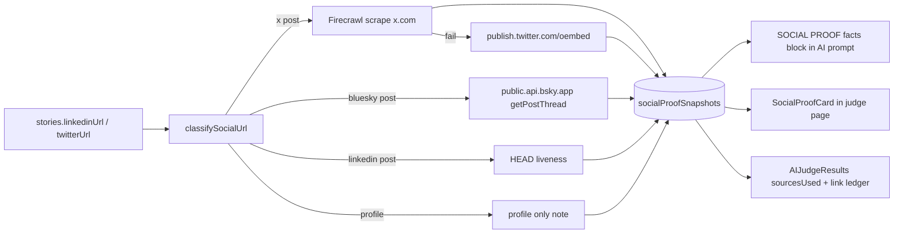

# Social proof for the AI judge and human judges

## Problem

The AI judge never sees `linkedinUrl` or `twitterUrl`: `getSubmissionForAnalysis` in [convex/aiJudge.ts](convex/aiJudge.ts) (lines 1492 to 1541) returns only `githubUrl` and `videoUrl`. Human judges get two bare external links in [src/pages/JudgingInterfacePage.tsx](src/pages/JudgingInterfacePage.tsx) (lines 1272 to 1298) and see different engagement numbers depending on when they click. The form fields accept "profile or announcement post" in one box, so a profile link must be told apart from a post.

## Decision

No X API. Firecrawl (already configured) has a dedicated `x-twitter` engine that returns author, date, likes, retweets, unrolled thread, and top replies for public x.com status URLs. Bluesky exposes counts through a free public endpoint. LinkedIn blocks every scraper, so it gets a liveness check and an explicit "metrics unavailable" note. Views are excluded on purpose: only the paid X API has them and LinkedIn never will, so a views based score would be unfair.

## Data flow

## Changes

### 1. Schema, [convex/schema.ts](convex/schema.ts)

- New table `socialProofSnapshots`, same shape philosophy as `videoTranscripts` (one row per story per field): `storyId`, `field` (`"linkedinUrl" | "twitterUrl"`), `url`, `platform` (`x | bluesky | linkedin | other`), `kind` (`post | profile | unknown`), `status` (`completed | liveness_only | profile_only | failed | unsupported`), `live: boolean`, `source` (`firecrawl-x | oembed | bsky-api | http-head | none`), `text?`, `author?`, `postedAt?`, `likes?`, `reposts?`, `replies?`, `errorMessage?`, `fetchedAt`. Index `by_story` and `by_story_field`.
- `aiJudgeResults.sourcesUsed.socialProof: v.optional(v.boolean())` next to `screenshot`.

### 2. URL classifier, new [convex/lib/socialLinks.ts](convex/lib/socialLinks.ts)

Pure function `classifySocialUrl(url)` returning `{ platform, kind, normalizedUrl, postId?, handle? }`. X post: `x.com|twitter.com/<handle>/status/<id>`. Bluesky post: `bsky.app/profile/<handle>/post/<rkey>`. LinkedIn post: `/posts/` or `/feed/update/`. Everything else on those hosts is `profile`. Mirrored to the frontend the same way `humanCriterionKey` was, so the card can label platform without importing server code.

### 3. Fetcher, new [convex/socialProof.ts](convex/socialProof.ts)

Modeled on [convex/videoTranscripts.ts](convex/videoTranscripts.ts):

- `getForStory` internalQuery, `save` internalMutation (upsert by story and field, idempotent).
- `fetchSocialProofContext(ctx, storyId, { linkedinUrl, twitterUrl })` used by the analysis action. Reuses a snapshot younger than a cache window, otherwise fetches in parallel with `Promise.all`. Never throws; each link degrades to a note.
  - X post: Firecrawl `/v1/scrape` with `formats: ["markdown"]` (same REST pattern as `scrapeWithFirecrawl`), parse `Likes:` and `Retweets:` lines and the `## Post` body from the engine's markdown. On failure call `https://publish.twitter.com/oembed?url=...&omit_script=1` for text, author, and date with metrics left undefined.
  - Bluesky post: resolve handle to DID via `com.atproto.identity.resolveHandle`, then `app.bsky.feed.getPostThread?depth=0` on `public.api.bsky.app`; read `likeCount`, `repostCount`, `replyCount`, `record.text`, `indexedAt`.
  - LinkedIn post: HEAD check only, `status: liveness_only`.
  - Profile URLs: `status: profile_only`, no network call.
- Public query `getSocialProofForStory({ groupId, storyId, sessionId? })`: judge session via `requireJudgeSession` when `sessionId` is passed, otherwise `requireJudgingGroupPermission(ctx, groupId, "judging.ai")`, matching the dual auth pattern at [convex/judgingGroupSubmissions.ts](convex/judgingGroupSubmissions.ts) line 1609.
- Public mutation `refreshSocialProofForGroup({ groupId })`: admin `judging.ai` permission, schedules one internal action per submission that bypasses the cache. This is the fairness control so every submission is measured at the same moment when submissions close.

### 4. Analysis, [convex/aiJudgeAnalysis.ts](convex/aiJudgeAnalysis.ts) and [convex/aiJudge.ts](convex/aiJudge.ts)

- `getSubmissionForAnalysis` adds `linkedinUrl` and `twitterUrl` to its return validator and payload.
- `analyzeSubmission` adds `fetchSocialProofContext` to the existing `Promise.all` at line 2421.
- `buildUserMessage` adds a `=== SOCIAL PROOF (verified by direct fetch) ===` section after the LIVE URL CHECK block: one line per link with platform, kind, live, metrics or `metrics unavailable (LinkedIn blocks automated reads)`, post date, and a capped post text excerpt.
- `buildSystemPrompt` gains one fixed rule next to the human criteria and screenshot rules: never invent or estimate engagement numbers; when metrics are unavailable score on post existence and content and say "unverified" in the reasoning; a profile link without a post is not a launch.
- `saveResult` path writes `sourcesUsed.socialProof` (true when at least one snapshot reached `completed`).
- New preset `SOCIAL_PROOF_PRESET` key `social-proof` exported from `convex/aiJudge.ts` alongside `FRONTEND_CHECKER_KEY` so the key is reserved and the same on both sides.

### 5. Admin UI, [src/components/admin/judging/GroupAiSection.tsx](src/components/admin/judging/GroupAiSection.tsx)

- Third preset Add button in `RubricWeightsCard` next to `COMPONENTS_CHECK_PRESET` and `FRONTEND_CHECKER_PRESET`, same Add flow and same custom count guard.
- "Refresh social proof" button in the AI section header area with the existing `useSaveState` pattern and a short note that it re snapshots every submission now.
- [src/components/admin/AIJudgeResults.tsx](src/components/admin/AIJudgeResults.tsx): add `socialProof` to the `sourcesUsed` chips (mirrors the `videoTranscript` chip at line 1591) and to the three local `sourcesUsed` types.

### 6. Judge UI, [src/pages/JudgingInterfacePage.tsx](src/pages/JudgingInterfacePage.tsx)

New `SocialProofCard` component in [src/components/judging/SocialProofCard.tsx](src/components/judging/SocialProofCard.tsx) rendered inside the existing Project Links box in place of the bare LinkedIn and Twitter rows. Per link: platform icon, kind badge (Post or Profile), post text excerpt, author and date, metric pills (likes, reposts, replies) when present, "captured 2h ago", and an Open link. LinkedIn shows "metrics not readable by bots, open the post to verify." No snapshot yet shows the plain link exactly as today, so nothing regresses before the first AI run or refresh. Uses `useQuery(api.socialProof.getSocialProofForStory, { groupId, storyId, sessionId })`. Existing design tokens only (`bg-surface-alt`, `border-hairline`, `text-copy`).

### 7. Docs, [src/components/admin/AdminDocs.tsx](src/components/admin/AdminDocs.tsx)

AI judge section: new "Social proof" paragraph covering which platforms return metrics, that LinkedIn is human verified, the refresh button, and the preset. Criteria section: one sentence that a human Social proof criterion can be mirrored and the AI will use the same snapshot.

## Edge cases

- Same URL in both fields: two snapshots, one per field, so the card and prompt stay field aligned.
- Firecrawl returns markdown without `Likes:` lines (engine change or credit limit): treat as text only, metrics undefined, status `completed`.
- oEmbed 404 means the post was deleted or is private: `status: failed`, `live: false`, prompt says post not found.
- Bluesky handle resolution fails: `status: failed` with the message.
- `FIRECRAWL_API_KEY` missing: X falls straight to oEmbed. No key at all for anything: still classify and liveness check, so the prompt is never silent about a supplied link.
- Post text capped at 1500 chars in the prompt, 4000 stored.
- Snapshot table has no delete path yet; rows are tiny and one per story per field.

## Verification

1. `npx convex dev --once` and `npx tsc -p tsconfig.app.json --noEmit` clean.
2. One-off internal action on dev against a real public x.com status URL confirms the hosted Firecrawl plan returns `Likes:` and `Retweets:` lines; if it does not, the oEmbed fallback path is exercised and documented as text only.
3. One-off against a real `bsky.app` post confirms counts.
4. Run the AI judge on the existing test group with `twitterUrl` set to an X post, a Bluesky post, and an X profile; confirm the SOCIAL PROOF block, `sourcesUsed.socialProof`, and the profile only note.
5. Judge session page shows the card for a story with a snapshot and the unchanged plain link for a story without one.
6. Re run without refresh reuses the snapshot (no second Firecrawl call in logs); refresh button forces new `fetchedAt`.
7. Existing flows untouched: run a group with no social links and confirm the prompt has no SOCIAL PROOF section and results save as before; eslint on touched files.

## Tracking

PRD at `prds/social-proof-judging.md` with UTC timestamps, then `TASK.MD`, `changelog.md` (dates from `git log`, all 2026-09-21 or the real commit day), `files.md` for the three new files, and a plain commit message.
